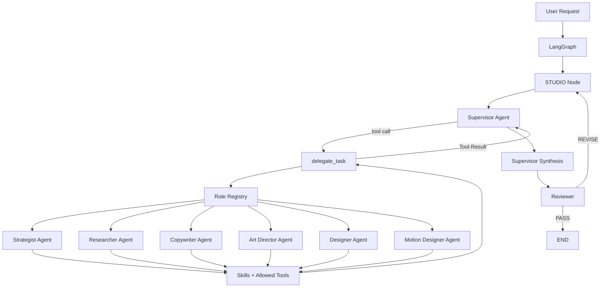

# LangGraphic Multi-Agent Design Studio

A **local-first, configuration-driven multi-agent framework** for building an AI-powered design studio with **LangGraph + LangChain + Ollama**.

本專案的目標不是建立一條固定的「LLM A → LLM B → LLM C」流水線，而是建立一個可以持續擴充的虛擬設計工作室：

* Supervisor 根據任務動態選擇需要的專業角色
* Role 透過 YAML 配置，而不是寫死在 Graph 中
* Skill 以 `SKILL.md` 按需載入
* Tool 透過角色白名單限制權限
* LangGraph 負責 Review / Retry / Termination 等確定性流程
* Ollama 作為本地 LLM Runtime
* 新增角色不需要修改 LangGraph topology

> Current status: **v0.1 Multi-Agent Foundation / Experimental**

---

## Why this project?

傳統多 Agent prototype 很容易變成：

```text
User
 ↓
Strategist
 ↓
Copywriter
 ↓
Art Director
 ↓
Designer
 ↓
END
```

這種流程的問題是：

* 每個任務都必須經過所有 Agent
* 新增角色就必須修改 Graph
* Prompt、Skill、Tool 與 Workflow 混在一起
* Agent 容易取得不必要的 Tool
* Workflow 很難測試
* 更換模型時容易牽動整個系統

LangGraphic Multi-Agent 採用不同的分層：

```text
Role      = 這個 Agent 是誰
Skill     = 這個 Agent 會什麼
Tool      = 這個 Agent 可以執行什麼
Agent     = Role + Skill + Tool + Model
Supervisor= 這次工作需要找誰
LangGraph = 公司流程如何運作
```

---

# Architecture



核心 Graph 本身只處理：

```text
START
  ↓
STUDIO
  ↓
REVIEW
  ├── PASS → END
  │
  └── REVISE → STUDIO
```

Graph 不負責判斷：

```text
這個任務應該找 Strategist 還是 Art Director？
```

這類語意 routing 由 Supervisor Agent 負責。

---

# Core Concepts

| Concept              | Responsibility                      |
| -------------------- | ----------------------------------- |
| **Role**             | 定義 Agent 的身份、責任、Prompt、Skills、Tools |
| **Skill**            | 可重複使用的專業方法、知識與 SOP                  |
| **Tool**             | Agent 可以真正呼叫的 Python 能力             |
| **Specialist Agent** | 執行特定專業任務                            |
| **Supervisor**       | 理解任務並動態委派 Specialist                |
| **Reviewer**         | 驗證結果並決定 Pass / Revise               |
| **LangGraph**        | 控制 State、Review loop 與 termination  |
| **Ollama**           | 本地 LLM runtime                      |

---

# Current Roles

目前 repository 提供以下範例角色：

```text
strategist
researcher
copywriter
art_director
designer
motion_designer
```

所有角色皆放在：

```text
src/studio/roles/
```

每個角色都是獨立 YAML configuration。

---

# Project Structure

```text
LangGraphic_MultiAgent/
│
├── src/
│   └── studio/
│       │
│       ├── graph.py
│       ├── state.py
│       ├── config.py
│       ├── demo.py
│       ├── doctor.py
│       ├── testing.py
│       │
│       ├── agents/
│       │   ├── factory.py
│       │   ├── supervisor.py
│       │   └── reviewer.py
│       │
│       ├── models/
│       │   ├── factory.py
│       │   └── ollama.py
│       │
│       ├── roles/
│       │   ├── strategist.yaml
│       │   ├── researcher.yaml
│       │   ├── copywriter.yaml
│       │   ├── art_director.yaml
│       │   ├── designer.yaml
│       │   └── motion_designer.yaml
│       │
│       ├── skills/
│       │   ├── loader.py
│       │   ├── brand-strategy/
│       │   │   └── SKILL.md
│       │   └── visual-direction/
│       │       └── SKILL.md
│       │
│       └── tools/
│           ├── registry.py
│           └── example_tools.py
│
├── tests/
│   ├── unit/
│   ├── graph/
│   └── integration/
│
├── .env.example
├── pyproject.toml
└── README.md
```

---

# Requirements

* Python **3.11+**
* Local Ollama
* An Ollama model capable of:

  * normal chat completion
  * tool calling
  * structured output

The quality and latency of multi-agent execution depend heavily on the selected local model.

---

# Quick Start

## 1. Clone

```powershell
git clone https://github.com/Jason25684531/LangGraphic_MultiAgent.git

cd LangGraphic_MultiAgent
```

## 2. Create virtual environment

```powershell
py -3 -m venv .venv
```

Activate:

```powershell
.\.venv\Scripts\Activate.ps1
```

## 3. Install

```powershell
.\.venv\Scripts\python -m pip install -e ".[dev]"
```

---

# Ollama Configuration

Copy the example configuration:

```powershell
Copy-Item .env.example .env
```

Example:

```env
LLM_PROVIDER=ollama

OLLAMA_BASE_URL=http://127.0.0.1:11434

OLLAMA_MODEL=gemma4:e2b

OLLAMA_TEMPERATURE=0

MAX_ITERATIONS=3

MAX_AGENT_TURNS=8
```

Change:

```text
OLLAMA_MODEL
```

to a model installed on your local Ollama runtime.

Check installed models:

```powershell
ollama list
```

---

# Runtime Diagnostics

Before running the Studio, verify the local model capabilities:

```powershell
.\.venv\Scripts\python -m studio.doctor
```

Expected output:

```text
PASS Server
PASS Model
PASS Generation
PASS Tool Calling
PASS Structured Output
```

The Doctor verifies:

```text
Ollama Server
      ↓
Configured Model
      ↓
Basic Generation
      ↓
Tool Calling
      ↓
Structured Output
```

A model that can generate text does **not automatically mean** it is suitable for this multi-agent runtime.

---

# Run the Studio

Example:

```powershell
.\.venv\Scripts\python -m studio.demo "Develop motion direction for a logo reveal."
```

Conceptually:

```text
User Request

"Develop motion direction for a logo reveal."

          ↓

Supervisor

          ↓

delegate_task(
    role="motion_designer",
    task="..."
)

          ↓

Motion Designer Agent

          ↓

Skills / Tools

          ↓

Supervisor Synthesis

          ↓

Reviewer

          ↓

PASS / REVISE
```

The Supervisor is free to call one or multiple specialists depending on the request.

---

# Dynamic Role System

The most important design constraint is:

> **Roles are configuration, not Graph topology.**

For example, adding:

```text
src/studio/roles/motion_designer.yaml
```

does not require adding:

```python
graph.add_node("motion_designer", ...)
```

or:

```python
if request == "motion":
    ...
```

The Supervisor discovers available roles from the `RoleRegistry`.

---

# Add a New Role

Create:

```text
src/studio/roles/ux_designer.yaml
```

Example:

```yaml
name: ux_designer

description: >
  Analyze user flows, interaction problems,
  information architecture and UX decisions.

system_prompt: |
  You are a UX Designer working in a multidisciplinary design studio.

  Focus on:
  - user goals
  - information architecture
  - interaction flow
  - usability
  - clear UX reasoning

skills:
  - ux-analysis

tools:
  - word_count

model_profile: default
```

Once the YAML is discovered by the `RoleRegistry`, the Supervisor can expose the role as an available specialist.

The LangGraph topology does not need to change.

---

# Skills

Skills represent reusable professional knowledge or procedures.

Directory format:

```text
src/studio/skills/
└── visual-direction/
    └── SKILL.md
```

A Skill contains metadata:

```markdown
---
name: visual-direction
description: Develop and evaluate visual direction for design work.
---

# Visual Direction

When developing visual direction:

1. Identify the communication goal.
2. Define audience and emotional tone.
3. Establish hierarchy.
4. Define composition.
5. Define typography direction.
6. Define color direction.
7. Evaluate consistency.
```

At Agent startup, only:

```text
name
description
```

are exposed to the Agent.

The full Skill body is loaded only when the Agent calls:

```text
load_skill("visual-direction")
```

This keeps context smaller and allows skills to grow independently from Agent prompts.

---

# Tools

Tools are executable capabilities.

Examples may include:

```text
word_count
web_search
search_reference
generate_image
read_file
write_file
render_html
call_comfyui
```

The current v0.1 repository only contains safe example tools used to validate the architecture.

A Tool must first be registered in:

```text
src/studio/tools/registry.py
```

Conceptually:

```python
TOOL_REGISTRY = {
    "word_count": word_count,
    "my_new_tool": my_new_tool,
}
```

Then explicitly granted to a Role:

```yaml
tools:
  - my_new_tool
```

This means:

```text
Tool exists
    ≠
Every Agent can use it
```

Tool permission is role-scoped.

---

# Specialist Agent Loop

Specialists support multi-step tool use.

Example:

```text
Art Director
     ↓
LLM
     ↓
load_skill("visual-direction")
     ↓
LLM
     ↓
another allowed tool
     ↓
LLM
     ↓
Final Result
```

Execution is protected by:

```text
MAX_AGENT_TURNS
```

to prevent infinite LLM ↔ Tool loops.

---

# Review Loop

Every Studio result passes through a Reviewer.

```text
Studio
  ↓
Reviewer
  │
  ├── PASS
  │      ↓
  │     END
  │
  └── REVISE
         ↓
      Supervisor
```

On revision, the next Studio iteration receives:

```text
Original request
Previous result
Review feedback
```

The Supervisor can then decide which specialist needs to be called again.

The Graph does not automatically rerun every role.

---

# State

The current Studio state tracks:

```text
request
result
review_status
review_feedback
iteration
delegations
```

Delegation records make it possible to inspect:

```text
which role was selected
what task was delegated
whether execution succeeded
```

without storing private model reasoning.

---

# Testing

The project separates deterministic framework tests from real local-model tests.

## 1. Offline Unit + Graph Tests

Does **not** require Ollama:

```powershell
.\.venv\Scripts\python -m pytest tests/unit tests/graph -v
```

These tests validate:

```text
Role loading
Skill loading
Tool registry
Agent construction
Dynamic role delegation
Multiple specialist delegation
Revision routing
Retry exhaustion
Graph behavior
```

---

## 2. Ollama Integration Tests

Requires a running Ollama server:

```powershell
.\.venv\Scripts\python -m pytest -m "ollama and not ollama_slow" -v
```

Validates real local-model behavior such as:

```text
Ollama connectivity
Tool calling
Structured output
Studio execution
```

---

## 3. Slow Multi-Agent Ollama Tests

Some local models may require significantly longer execution time for multi-role workflows.

Run separately:

```powershell
.\.venv\Scripts\python -m pytest -m ollama_slow -v
```

These tests are intentionally isolated from normal development validation.

---

## 4. Full Test Suite

```powershell
.\.venv\Scripts\python -m pytest -v
```

---

# Testing Philosophy

The project intentionally separates:

```text
Software correctness
        ↓
Fake / scripted models
```

from:

```text
Model capability
        ↓
Real Ollama
```

and from:

```text
Model performance
        ↓
Slow multi-agent scenarios
```

A slow local model does not automatically indicate that the LangGraph architecture is incorrect.

---

# Current Scope

The current version is a **multi-agent foundation**, not yet a complete design automation product.

Implemented:

* LangGraph workflow
* Dynamic Supervisor Agent
* YAML-driven Role Registry
* Specialist Agents
* Multi-turn Tool Calling
* Skill progressive loading
* Tool permission boundaries
* Reviewer / revision loop
* Local Ollama runtime
* Offline graph tests
* Ollama integration tests
* Slow multi-role test separation

Not yet included:

* Figma integration
* ComfyUI integration
* Image generation pipeline
* Browser automation
* Production web research
* Persistent project memory
* Vector database
* Multi-user workspace
* Cloud model providers
* UI / Web application
* Production deployment

---

# Roadmap

## v0.1 — Multi-Agent Studio Kernel

Goal:

```text
Configuration-driven roles
Dynamic Supervisor
Skills
Tools
Review loop
Local Ollama
Testing foundation
```

---

## v0.2 — Agent Evaluation

Planned direction:

```text
Benchmark briefs
Role-selection evaluation
Tool-call evaluation
Agent trajectory evaluation
Output quality evaluation
Model comparison
```

Potential evaluation layer:

```text
OpenEvals
```

---

## v0.3 — Design Production Tools

Possible integrations:

```text
Web research
Reference search
Image generation
ComfyUI
File operations
PDF generation
Presentation generation
```

---

## v0.4 — Artifact Workspace

Potential architecture:

```text
Project workspace
Artifact registry
Version history
Parallel specialists
Human approval
Persistent state
```

---

# Design Principle

When deciding between:

```text
More Agent autonomy
```

and:

```text
Simple deterministic software
```

prefer deterministic software unless LLM reasoning provides clear value.

LangGraph controls the company process.

Supervisor decides who should work.

Specialists perform professional work.

Skills provide reusable knowledge.

Tools execute actions.

---

# Project Status

```text
Current Stage:
v0.1 Multi-Agent Foundation

Runtime:
Local Ollama

Workflow:
LangGraph

Role System:
YAML + RoleRegistry

Orchestration:
Dynamic Supervisor + delegate_task

Review:
Structured Reviewer + Revision Loop

Status:
Experimental / Active Development
```
